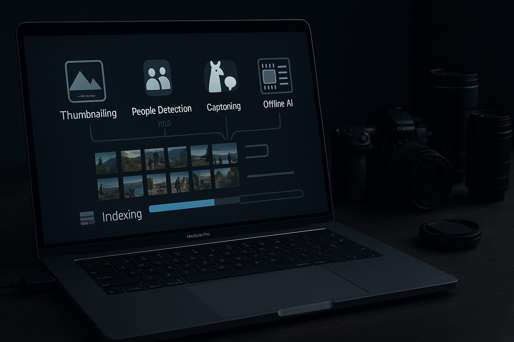

# 📷 Photo-Indexer



**Photo-Indexer** is an offline pipeline that walks through a folder of DSLR RAW photos (`*.NEF`), creates lightweight thumbnails, runs three vision models, and stores rich metadata in an embedded database.
Designed for a **CPU-only MacBook with 32 GB RAM (Metal/MPS available)**, but scales up without code changes.

| Stage                        | Model / Tool                    | Output                                   |
| ---------------------------- | ------------------------------- | ---------------------------------------- |
| Thumbnail + EXIF             | `rawpy`, `piexif`               | 512 px RGB JPEG, `DateTimeOriginal`, GPS |
| Scene label & indoor/outdoor | AlexNet-Places365               | e.g. `outdoor`, `mountain`               |
| Person detection & count     | YOLOv10-s                       | `people =true`, `count = 4`              |
| Caption & fallback location  | **Ollama** (llama3.2-vision) **or** **OpenAI** (gpt-4o) | One-sentence caption                     |
| Fusion & storage             | Python                          | One row per photo in SQLite + FTS5       |

---

## ✨ Features

* **100 % open source** – only PyPI wheels and model checkpoints.
* **Flexible captioning** – choose between local Ollama models or cloud OpenAI vision models.
* **Offline-capable** – pull models once, index with zero network (when using Ollama).
* **Thread-pooled** – keeps all CPU cores busy; overlaps disk I/O and REST calls.
* **Pluggable** – swap SQLite for DuckDB, configure caption providers via CLI or config file.
* **Thumbnail cache** – first pass builds `.jpg` thumbs; re-runs skip RAW decoding.

---

## ⏩ Quick start

Tested on **macOS 12 / 14, Python 3.11, Ollama 0.1.34+**.

> 📋 **Configuration**: See [`config.example.yaml`](config.example.yaml) for detailed provider and model settings.

```bash
# 1 — clone the repo
git clone https://github.com/akshayranganath/photo-indexer.git
cd photo-indexer

# 2 — system dependencies (Homebrew)
/bin/bash scripts/prepare_env.sh    # optional helper
# or follow docs/setup_mac.md

# 3 — Python environment
python3.11 -m venv .venv && source .venv/bin/activate
pip install -U pip
pip install -r requirements.txt

# 4 — fetch model weights
bash scripts/download_weights.sh    # AlexNet-Places365 files, sample NEFs
# YOLOv10-s downloads automatically on first run

# 5a — Caption provider option 1: Ollama (local, offline)
ollama pull llama3.2-vision:latest  # or llava-next:latest
pi index /Volumes/DSLR_backup --caption-provider ollama --workers 8

# 5b — Caption provider option 2: OpenAI (remote, requires API key)
export OPENAI_API_KEY=sk-your-openai-key-here
pi index /Volumes/DSLR_backup --caption-provider openai --workers 8

# 6 — Browse and search your photos (optional)
pi ui                                   # Launch web interface on http://localhost:8501
```

First run compiles Torch-Metal kernels; expect \~2 min start-up lag.

**Test your OpenAI API key** (optional):
```bash
python -m photo_indexer.models.captioner --test-api-key
```

---

## 🏗️ Project layout

```
photo-indexer/
├─ scripts/               helper shell scripts
├─ data/                  thumbnails & databases (git-ignored)
├─ src/photo_indexer/     main package
│  ├─ cli.py              entry-point (`pi`)
│  ├─ pipelines/          preprocess, vision, fusion, db
│  ├─ models/             model adapters (AlexNet, YOLO, Ollama/OpenAI captioners)
│  ├─ utils/              exif, geo, logging, etc.
│  └─ workers.py          thread orchestration
└─ tests/                 pytest suite
```

A deeper diagram lives in `docs/ARCHITECTURE.md`.

---

## 🌐 Web Interface

After indexing your photos, launch the web-based search interface:

```bash
pi ui                                   # Launch on default port 8501
pi ui --port 8080                       # Custom port
pi ui --host 0.0.0.0 --port 8080        # Allow external connections
```

**Features:**
- **🔍 Full-text search** across photo descriptions, locations, and scenes
- **📷 Grid-based browsing** with responsive thumbnail layout
- **📊 Database statistics** showing total photos, scenes, and date ranges
- **🎯 Smart caching** with automatic thumbnail generation and storage
- **📱 Responsive design** works on desktop and mobile browsers

**Search examples:**
- `mountain sunset` - Find mountain scenes at sunset
- `beach family` - Photos with people at the beach
- `indoor birthday` - Indoor photos with birthday-related content
- `outdoor` - All outdoor scenes

The UI automatically connects to your indexed database and provides instant search across all photo metadata.

---

## 🔧 CLI overview

The `pi` command provides two main functions:

### Indexing Photos
```
Usage: pi index [OPTIONS] PHOTO_ROOT

  Index all .NEF files under PHOTO_ROOT.

Options:
  --workers INTEGER                    Concurrent threads (default: CPU count)
  --db {sqlite,duckdb}                 Storage backend (default: sqlite)
  --thumb-size INTEGER                 Long-edge pixels for JPEG cache (default: 512)
  --caption-provider {ollama,openai}   Captioning provider: 'ollama' (local) or 'openai' (remote)
  --caption-model TEXT                 Caption model name. Defaults: 'llama3.2-vision:latest' (Ollama) or 'gpt-4o' (OpenAI)
  --ollama-host TEXT                   Ollama host URL (default: http://localhost:11434)
  --openai-api-key TEXT                OpenAI API key (overrides OPENAI_API_KEY env var)
  --verbose, -v                        Enable DEBUG-level logging
  --dry-run                            Run pipeline but skip final DB insert (for timing tests)
  --help                               Show this message and exit
```

### Web Interface
```
Usage: pi ui [OPTIONS]

  Launch the web-based photo search interface.

Options:
  --port INTEGER    Port for the Streamlit web server (default: 8501)
  --host TEXT       Host address for the Streamlit web server (default: localhost)
  --help            Show this message and exit
```

---

## 🚀 Performance tips

* Use `--workers 6-8` on a 10-core Apple Silicon; higher counts seldom help.
* Keep the laptop on mains – Metal can fall back to CPU on low battery.
* **Ollama vs OpenAI trade-offs:**
  - **Ollama**: Slower but private, offline-capable, free after model download
  - **OpenAI**: Faster, higher quality, but requires internet and costs per image (~$0.01-0.02/image)
* Configure via file instead of CLI for complex setups:

  ```bash
  mkdir -p ~/.config/photo_indexer
  cp config.example.yaml ~/.config/photo_indexer/config.yaml
  # Edit the config file, then run:
  pi index ~/photos --workers 8
  ```

---

## 📄 License

Code is MIT-licensed (see `LICENSE`).
Model checkpoints retain their original licenses (MIT for Places365, YOLOv10 Apache-2.0, Llama 3.2 Community License).
OpenAI API usage subject to [OpenAI's Terms of Service](https://openai.com/policies/terms-of-use).

Happy indexing!
